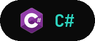

<div align="center">


<a href="https://github.com/RanaZaid26194">
  
</a>

<br/>

<a href="https://www.linkedin.com/in/rana-zaid26194"></a>
<a href="mailto:ranazaide288@gmail.com"></a>
<a href="https://skeptix.netlify.app"></a>
<a href="https://gpify.vercel.app"></a>
<a href="https://vigil-x.netlify.app"></a>

</div>

<br/>

```yaml
about_me:
  role: "CS Undergraduate — FAST-NUCES Lahore"
  semester: 3
  cgpa: 3.77
  status: "2x Dean's List"
  approach: >
    end-to-end builder | automation, full-stack apps,
    small tools that solve problems I actually run into
  currently_learning: >
    AI/ML fundamentals, applied where they meet
    the tools I already build
```

<br/>

### Tech Stack

<p align="center">
  
  
  
  
  
</p>
<p align="center">
  
  
  
  
</p>
<p align="center">
  
  
  
  
</p>

<br/>

### Featured Projects

<table>
<tr>
<td width="33%" valign="top" align="center">

<br/>

<a href="https://skeptix.netlify.app"></a>

<br/>

<sub>Citation-backed AI research assistant with Supabase + Google OAuth. Built around citation reliability, multi-format export accuracy, and a "Skeptic Mode" for stricter fact-checking.</sub>

</td>
<td width="33%" valign="top" align="center">

<br/>

<a href="https://gpify.vercel.app"></a>

<br/>

<sub>Private, offline-friendly GPA/SGPA/CGPA calculator for FAST-NUCES students. Implements official absolute + MCA-based relative grading exactly. What-if projections, target-percentage solver, PDF/PNG export. 100% client-side.</sub>

</td>
<td width="33%" valign="top" align="center">

<br/>

<a href="https://vigil-x.netlify.app"></a>

<br/>

<sub>Python/Playwright automation that pulls data from the NUCES FLEX portal across multiple accounts. Humanized interaction patterns for reCAPTCHA reliability, scheduled via Windows Task Scheduler.</sub>

</td>
</tr>
</table>

<br/>

### GitHub Stats

<div align="center">


<br/>


</div>

<br/>

<div align="center">


</div>

<br/>

<div align="center">

*Always open to talking about interesting problems — reach out anytime.*


</div>